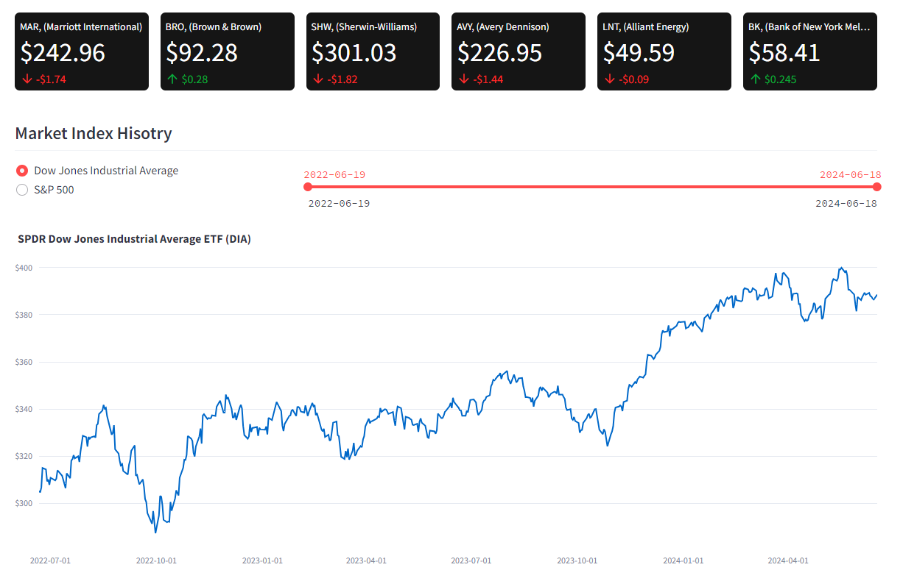
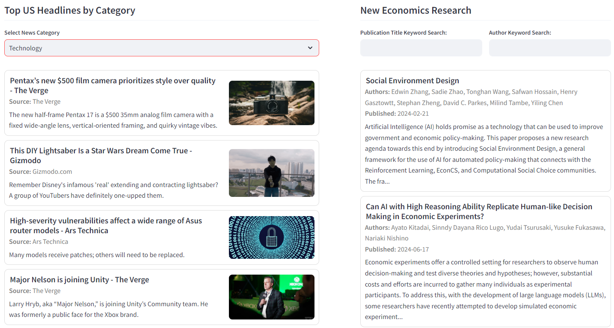
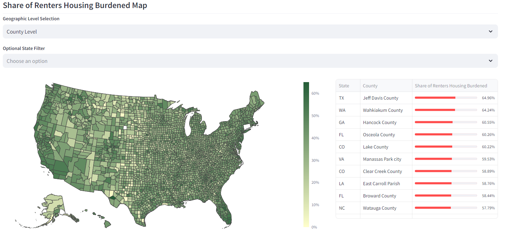
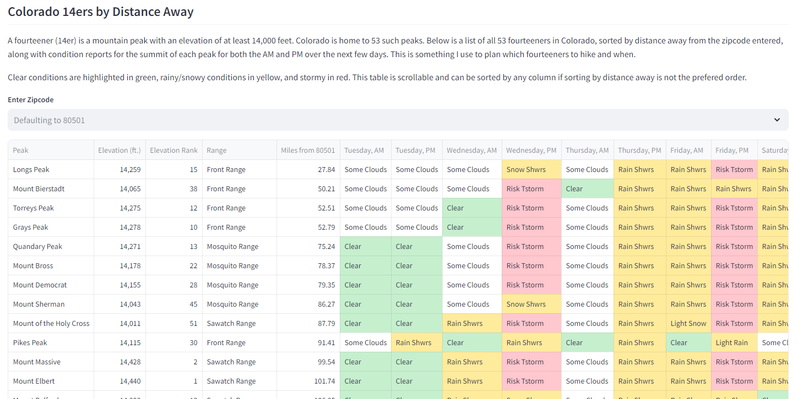

# Master Dashboard

Welcome to my Master Dashboard project! This project is a web-based dashboard application built with [Streamlit](https://streamlit.io/), designed to be a one-stop shop for all the things I care about (that happen to have free APIs or be easily web-scraped). While still being actively developed, when complete it will contain things like News, Weather, Stocks, Economic Statistics, and more. 

## Table of Contents
- [Published Location](#published-location)
- [Dashboard Sections](#dashboard-sections)
- [Local Installation](#local-installation)

## Published Location
Access the live published version of my dashboard [here.](https://master-dashboard.streamlit.app/)

## Dashboard Sections
1. **Stock Market** <br>
   This section provides market updates and tracking by pulling stock data over the last two years. Users can enter a specific stock in the Select Stock Overview section to see its current price and change since previous close, 52-week high and low, YoY price change in dollars and percent, and a candle stick chart for that stock spanning the last two years. <br><br>
   The stock apis used in this section can only access data on specific stocks, so market level charts for the DOW and S&P 500 are not possible. Instead I included charts showing the performance of DIA and VOO, which are DOW and S&P 500 tracking index funds respectively.
   <br>
   <br><br>
2. **News and Research**<br>
   This sections provides top US news headlines by news category (a user input), as well as newly published applied, mainly microeconomic research that a user can filter by keywords.<br>
   <br><br>
3. **Housing Statistics**<br>
   This sections provides US housing statistics obtained from the U.S. Census Bureau's American Community Survey (1-year and 5-year). A user can filter the various charts by time frame, state, and choose which metrics to see charts for.<br>
   <br><br>
3. **Colorado 14ers**<br>
   This sections provides data on Colorado fourteeners, peaks over 14,000 ft. in elevation. A user can input their zipcode, and see the list sorted by 14er distance to them. It also shows the weather forecast conditions on each peak in the
   morning and evening for the upcoming days, which can be used to plan which will be ideal to hike/climb and when.<br>
   <br><br>
   

## Local Installation
To run this dashboard locally, follow these steps:

1. **Clone the Repository**
    ```sh
    git clone https://github.com/rd-wendling/master-dashboard.git
    cd master-dashboard
    ```

2. **Install Dependencies**
    Make sure you have Python installed (this was created using version 3.11). Then, install the required Python packages:
    ```sh
    pip install -r requirements.txt
    ```

3. **Run the Application**
    ```sh
    streamlit run app.py
    ```

Once the application is running, open your web browser and navigate to `http://localhost:8501` to view the dashboard.

### Command Line Options
- `--server.port`: Specify the port to run the application (default is 8501).
- `--server.headless`: Run the server in headless mode (useful for deployment).
